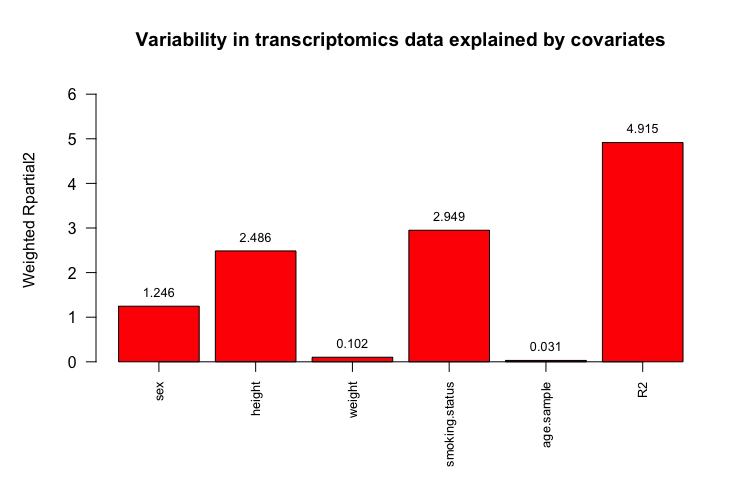

# The Principal Component Partial R-squared method <br /> (PC-PR2)


#### Background

The PC-PR2 is a statistical method, developed by Fages & Ferrari et al. (1), for investigating sources of variability in metabolomics or other omics data (1,2). In brief, it combines features of principal component and multivariable linear regression analyses to estimate the relative effects of metadata variables upon a large matrix of omics measurements. 

The `pcpr2` R package has been created to simplify the analysis so it can easily be incorporated into larger workflows. To execute the analysis, a complete matrix of omics data, denoted X, and a corresponding table of subject metadata, denoted Z, are passed to the function `runPCPR2()`. The main output is the proportion of variation in the omics data attributed to each Z-variable, expressed as R<sub>partial</sub><sup>2</sup>. A barplot of these values can be quickly generated by passing the output to `plot()`.

A sample of a transcriptomics dataset is included as test data. This consists of a matrix of 3000 transcriptomics intensities and five descriptive Z-variables (two categorical, three numeric) for 124 subjects.

#### Installation and usage

To start, update all installed R packages.

````r
update.packages()
````

The `devtools` package is needed to install development packages from GitHub. If it is not already installed on your system, install it from CRAN. Now install `pcpr2` as follows:

````r
library(devtools)
install_github("JoeRothwell/pcpr2")
````

You may be prompted to update other packages.

PC-PR2 is performed using the function `runPCPR2()` which outputs an object of class `pcpr2` including partial R<sup>2</sup> values for each covariate. The variability in the omics data desired to be explained can be set with the argument `pct.threshold`, which is optional and defaults to 0.8.

A sample of transcriptomics data is provided as an example.

````r
library(pcpr2)
output <- runPCPR2(transcripts, Z_metadata, pct.threshold = 0.8)
output$pR2
           sex         height         weight smoking.status     age.sample             R2 
    1.24647643     2.48569520     0.10218837     2.94946793     0.03072886     4.91513509 
````

For detailed output, use `summary()`.

````r
summary(output)
````

To quickly plot a barplot, pass the pcpr2 object to `plot()`.

````r
plot(output, col = "red", main = "Variability in transcriptomics data explained by covariates")
````
<p align="center">

</p>

#### References

(1) Fages & Ferrari et al. (2014) Investigating sources of variability in metabolomic data in the EPIC study: the Principal Component Partial R-square (PC-PR2) method. *Metabolomics* 10(6): 1074-1083, DOI: 10.1007/s11306-014-0647-9

(2) Perrier et al. (2018) Identifying and correcting epigenetics measurements for systematic sources of variation.
*Clin Epigenetics* 21(10): 38, DOI: 10.1186/s13148-018-0471-6
